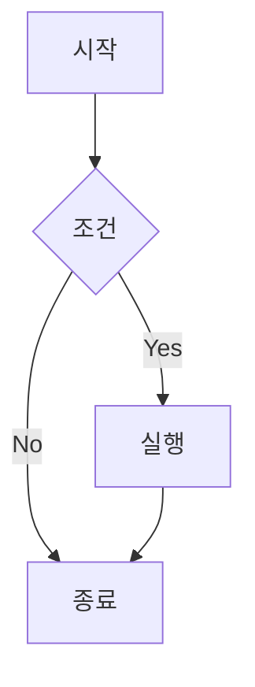
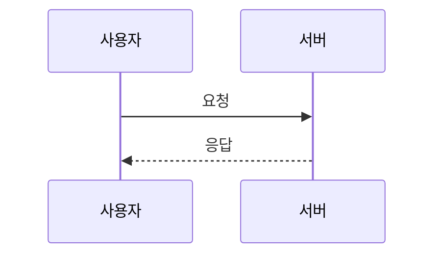
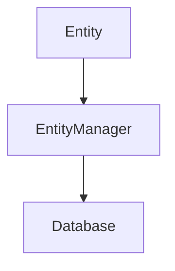

# Jekyll Chirpy 테마 완전 가이드

## 글 작성 방법

### 1. 파일 생성
- `_posts` 폴더에 `YYYY-MM-DD-제목.md` 형식으로 생성
- 예: `2025-08-10-새로운-포스트.md`

### 2. Front Matter 작성 (파일 맨 위)
```yaml
---
title: "포스트 제목"
author: Ijzereen
date: 2025-08-10 14:30:00 +0900
categories: ["Backend", "Frontend"]
tags: [tag1, tag2, tag3]
# 포스트 대표 이미지 (선택사항)
image: 
  path: posts/이미지파일.png
  alt: 이미지 설명
# 수학 수식 사용 (선택사항)
math: true
# Mermaid 다이어그램 사용 (선택사항)
mermaid: true
# 핀 고정 포스트 (선택사항)
pin: true
---
```

### 3. 마크다운 내용 작성

## Author 설정

### 1. `_data/authors.yml` 파일에 작성자 정의
```yaml
Ijzereen:
  name: Ijzereen
  twitter: twitter_username  # 선택사항
  url: https://github.com/ijzereen
```

### 2. 포스트에서 author 사용
- Front Matter에 `author: Ijzereen` 추가 (대소문자 정확히 일치해야 함)
- authors.yml에 정의된 작성자만 표시됨

## 이미지 첨부 방법

### 1. 이미지 파일 업로드
- `assets/img/posts/` 폴더에 이미지 파일 저장
- 파일명: 영문, 숫자, 하이픈(-), 언더스코어(_) 사용 권장

### 2. 대표 이미지 설정 (Front Matter)
```yaml
image: 
  path: posts/이미지파일.png
  alt: 이미지 설명
```

### 3. 본문 내 이미지 삽입
```markdown

```

## 코드 블록 사용법

### 1. 인라인 코드
```markdown
`코드 내용`
```

### 2. 코드 블록
```markdown
```언어명
코드 내용
```
```

### 3. 파일명과 함께 코드 블록
```markdown
```java
// file: "src/main/java/Example.java"
public class Example {
    public static void main(String[] args) {
        System.out.println("Hello World");
    }
}
```
```

### 4. 지원하는 언어
- java, javascript, python, bash, yaml, json, html, css, sql, kotlin, swift, go 등

## 수학 수식 (MathJax)

### 1. Front Matter에 활성화
```yaml
math: true
```

### 2. 인라인 수식
```markdown
$$ x = \frac{-b \pm \sqrt{b^2-4ac}}{2a} $$
```

### 3. 블록 수식
```markdown
$$
\begin{align}
E &= mc^2 \\
F &= ma
\end{align}
$$
```

## 다이어그램 (Mermaid)

### 1. Front Matter에 활성화
```yaml
mermaid: true
```

### 2. 플로우차트
```markdown

```

### 3. 시퀀스 다이어그램
```markdown

```

## 카테고리와 태그

### 1. 카테고리 페이지 자동 생성
- `categories: ["Backend", "Database"]` 형태로 작성
- `/categories/backend/`, `/categories/database/` 페이지 자동 생성

### 2. 태그 페이지 자동 생성
- `tags: [java, spring, jpa]` 형태로 작성
- `/tags/java/`, `/tags/spring/` 페이지 자동 생성

## 댓글 시스템

### 1. Giscus 설정 (_config.yml)
```yaml
comments:
  provider: giscus
  giscus:
    repo: ijzereen/ijzereen.github.io
    repo_id: YOUR_REPO_ID
    category: Comments
    category_id: YOUR_CATEGORY_ID
    mapping: title
    lang: ko
```

### 2. Giscus 설정 방법
1. https://github.com/apps/giscus 에서 저장소에 앱 설치
2. https://giscus.app 에서 설정값 생성
3. `_config.yml`에 설정값 입력

### 3. 댓글 비활성화
```yaml
comments:
  provider: # 비워두면 비활성화
```

## 검색 기능

### 1. 내장 검색
- 우상단 검색 아이콘 클릭 또는 `/` 키
- 제목, 내용, 태그에서 검색 가능

### 2. Google Search Console 연결
```yaml
webmaster_verifications:
  google: YOUR_VERIFICATION_CODE
```

## 사이드바 설정

### 1. 탭 메뉴 (`_tabs/` 폴더)
- `about.md`: 소개 페이지
- `categories.md`: 카테고리 목록
- `tags.md`: 태그 목록
- `archives.md`: 전체 포스트 목록

### 2. 새 탭 추가
`_tabs/` 폴더에 새 `.md` 파일 생성:
```yaml
---
title: 새 메뉴
icon: fas fa-stream
order: 5
---
```

## 다크/라이트 테마

### 1. 기본 테마 설정 (_config.yml)
```yaml
theme_mode: # [light | dark] 또는 비워두면 시스템 설정 따름
```

### 2. 사용자가 토글 버튼으로 변경 가능
- 좌하단 테마 토글 버튼

## 아바타 및 파비콘

### 1. 아바타 설정
- `assets/img/avatar.jpg` 파일 교체
- `_config.yml`에서 경로 수정 가능

### 2. 파비콘 설정
- `assets/img/favicons/` 폴더의 파일들 교체
- https://realfavicongenerator.net/ 에서 생성 권장

## 구글 애널리틱스

### 1. Google Analytics 4 설정
```yaml
analytics:
  google:
    id: G-XXXXXXXXXX
```

### 2. GoatCounter 설정 (대안)
```yaml
analytics:
  goatcounter:
    id: your-site-name
```

## PWA (Progressive Web App)

### 1. PWA 활성화 (_config.yml)
```yaml
pwa:
  enabled: true
  cache:
    enabled: true
```

### 2. 기능
- 오프라인 캐싱
- 홈 화면에 앱 추가 가능
- 서비스 워커 자동 생성

## SEO 최적화

### 1. 메타 태그 자동 생성
- `title`, `description`, `image` 설정시 자동으로 SEO 태그 생성

### 2. 사이트맵 자동 생성
- `/sitemap.xml` 자동 생성
- Google Search Console에 등록

### 3. RSS 피드
- `/feed.xml` 자동 생성

## 로컬 개발

### 1. 의존성 설치
```bash
bundle install
```

### 2. 로컬 서버 실행
```bash
bundle exec jekyll serve
```
또는 실시간 리로드:
```bash
bundle exec jekyll serve --livereload
```

### 3. 접속 주소
http://localhost:4000

## 배포

### 1. Git으로 업로드
```bash
git add .
git commit -m "새 포스트 추가"
git push origin main
```

### 2. GitHub Pages 자동 배포
- main 브랜치에 푸시하면 자동으로 빌드 및 배포됨
- GitHub Actions로 자동 빌드 (`.github/workflows/pages-deploy.yml`)

## 커스터마이징

### 1. 색상 테마 변경
- `_sass/addon/variables.scss` 파일 수정
- CSS 변수로 색상 정의

### 2. 폰트 변경
- `_sass/addon/commons.scss` 파일 수정
- Google Fonts 연결 가능

### 3. 레이아웃 수정
- `_layouts/` 폴더의 파일들 수정
- `_includes/` 폴더의 컴포넌트 수정

## 문제 해결

### 1. 빌드 오류
```bash
bundle exec jekyll build --trace
```

### 2. 캐시 삭제
```bash
bundle exec jekyll clean
```

### 3. 의존성 업데이트
```bash
bundle update
```

## 주요 디렉토리 구조
```
.
├── _config.yml          # 사이트 설정
├── _data/
│   ├── authors.yml      # 작성자 정보
│   ├── contact.yml      # 연락처 정보
│   └── share.yml        # 공유 버튼 설정
├── _posts/              # 블로그 포스트
├── _tabs/               # 사이드바 탭 메뉴
├── assets/
│   └── img/
│       ├── posts/       # 포스트 이미지
│       ├── favicons/    # 파비콘
│       └── avatar.jpg   # 아바타 이미지
└── _sass/               # 스타일시트
```

## 예시 포스트 구조
```markdown
---
title: "JPA 기본 개념"
author: Ijzereen
date: 2025-08-10 14:30:00 +0900
categories: ["Backend", "DB"]
tags: [jpa, hibernate, database]
image: 
  path: posts/jpa-intro.png
  alt: JPA 개념도
math: true
mermaid: true
pin: false
---

## 소개
JPA에 대해 알아보겠습니다.

### 주요 특징
- 객체 관계 매핑
- 영속성 컨텍스트

```java
@Entity
public class Member {
    @Id
    private Long id;
    private String name;
}
```

### 수식 예제
$$ E = mc^2 $$

### 다이어그램 예제



```